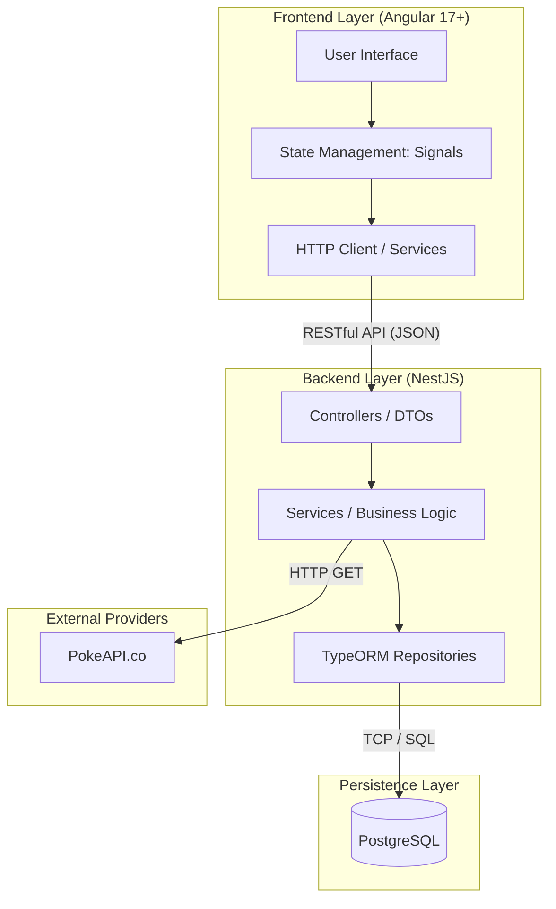

# 🏗️ Arquitectura del Sistema

Este documento describe la arquitectura de software de la **Pokedex Analytics Platform**, una aplicación web moderna diseñada desde cero bajo el paradigma de **Arquitectura Desacoplada (Client-Server)**. 

La adopción de esta arquitectura garantiza alta escalabilidad, mantenibilidad independiente de las capas y una experiencia de usuario (UX) reactiva. Además, el uso de **TypeScript** en ambos extremos (Frontend y Backend) asegura un contrato de datos estricto y predecible.

---

## 1. Diagrama de Arquitectura de Alto Nivel

El flujo de la aplicación sigue un modelo de tres capas (Three-Tier Architecture), orquestado íntegramente mediante contenedores Docker.

---

## 2. Descripción de las Capas

### A. Capa de Presentación (Frontend - Angular)
Actúa como una *Single Page Application* (SPA) reactiva. Su única responsabilidad es el consumo de la API, el manejo del estado del cliente y la presentación visual de los datos.
*   **Gestión de Estado (Reactivity):** Utiliza **Signals** (nativos de Angular 17+) para un control granular y síncrono del estado de la interfaz, eliminando la necesidad de librerías externas complejas (como NgRx) y mejorando el rendimiento del renderizado (Change Detection).
*   **Modularidad por Dominio (Feature-based):** Agrupa lógica, vistas y servicios en la carpeta `features/pokedex/`, aplicando principios de *Domain-Driven Design (DDD)* simplificado.
*   **Transformación de Presentación (Pipes):** El Frontend recibe datos "crudos" del servidor (ej. Hectogramos y Decímetros). Se utilizan *Pipes* personalizados (`kg.pipe`, `cm.pipe`) para formatear estos valores exclusivamente en tiempo de ejecución para la vista, manteniendo el modelo de datos limpio.

### B. Capa de Aplicación (Backend - NestJS)
El corazón del sistema. Actúa como orquestador, protegiendo la base de datos y encapsulando las reglas de negocio. Sigue los principios de la **Clean Architecture**.
*   **Controllers (Controladores):** Capa de entrada HTTP. Su única función es recibir peticiones, validar la entrada usando **DTOs (Data Transfer Objects)** fuertemente tipados con `class-validator` y retornar la respuesta. Además, se implementa el `ValidationPipe` global con `transform: true` y `enableImplicitConversion: true` para garantizar que los Query Params (strings en la URL) se conviertan automáticamente a números reales antes de llegar a la lógica.
*   **Services (Casos de Uso):** Contienen toda la lógica de negocio. Aquí ocurre la orquestación para consumir la PokeAPI externa mediante procesamiento por lotes (*batching*) y la preparación de los datos para la persistencia.
*   **Manejo Global de Excepciones:** Implementación de *Exception Filters* para capturar cualquier error (404, 500) y devolver al Frontend una estructura JSON estandarizada y segura.

### C. Capa de Persistencia (PostgreSQL + TypeORM)
Responsable del almacenamiento seguro y persistente de los datos analíticos.
*   **PostgreSQL:** Seleccionado por ser un RDBMS robusto, *ACID compliant* y excelente para el manejo de consultas y filtrados relacionales.
*   **TypeORM:** ORM (Object-Relational Mapper) que utiliza el patrón *Data Mapper*. Los repositorios (`Repositories`) abstraen el SQL directo, permitiendo construir consultas complejas (como la búsqueda de tipos o rangos de peso/altura) utilizando el `QueryBuilder`.

---

## 3. Principios de Diseño Aplicados

1.  **Separation of Concerns (SoC):** Separación estricta entre la presentación de los datos (Angular) y el procesamiento/acceso a los mismos (NestJS).
2.  **Inyección de Dependencias (DI):** Ambos frameworks (Angular y NestJS) utilizan contenedores de Inyección de Dependencias para proveer servicios, lo que facilita enormemente el testing unitario mediante el uso de *Mocks* y *Stubs*.
3.  **Single Source of Truth (SSOT):** La base de datos PostgreSQL actúa como la única fuente de verdad del sistema. El frontend nunca guarda datos locales permanentes, siempre se sincroniza con el estado del backend.
4.  **Fail-Fast y Validación Temprana:** Si el Frontend envía un parámetro inválido (ej. texto en lugar de un número de peso), el Backend intercepta y rechaza la petición en la capa de DTOs antes de que la lógica de negocio sea siquiera invocada.

---

## 4. Ciclo de Vida de los Datos (Data Flow)

**Escenario: Sincronización Inicial (Ingesta)**
1. El usuario hace clic en "Sincronizar" en Angular.
2. El `PokemonService` del Frontend despacha un `POST /api/pokemons/sync`.
3. El `PokemonController` de NestJS recibe la petición y delega al `PokemonService`.
4. El servicio realiza peticiones HTTP orquestadas por lotes (*Promise.all en chunks*) hacia la PokeAPI para evitar colapsar la memoria y prevenir *timeouts*, normaliza las respuestas JSON, e invoca al `PokemonRepository`.
5. TypeORM ejecuta un `UPSERT` (o `get_or_create`) en PostgreSQL.
6. El Backend responde `201 Created` (o `202 Accepted`) al Frontend.
7. Las *Signals* de Angular reaccionan al éxito y refrescan la tabla de datos en pantalla.

---
## 5. Estrategia Arquitectónica de Pruebas (Testing)

El sistema está diseñado para ser altamente testable desde el día cero, utilizando **Jest** como motor de pruebas estándar en ambas capas:

*   **Backend (NestJS):** 
    *   **Unitarias (Jest):** Los *Services* se prueban aislando la base de datos (mockeando los Repositories) y la red.
    *   **Integración (Supertest):** Se validan los *Controllers* contra una base de datos de pruebas para asegurar el contrato de API.
*   **Frontend (Angular):**
    *   **Unitarias (Jest):** Se validan *Pipes* (ej. 69 hg -> 6.9 kg), *Services* (mockeando `HttpClient`) y la reactividad de los componentes usando `TestBed` y verificación de actualizaciones en las *Signals*.
