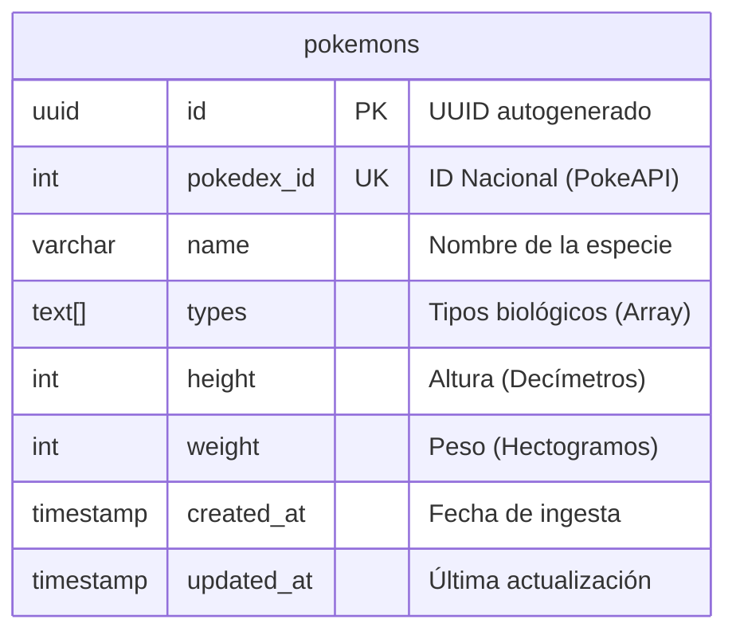

# 💾 Base de Datos: PostgreSQL & TypeORM

Este documento describe la arquitectura de la base de datos relacional y las decisiones de diseño para la capa de persistencia de la **Pokedex Analytics Platform**.

## 1. Visión General

El sistema utiliza **PostgreSQL 16** como motor de base de datos principal, gestionado a través de **TypeORM**. 
TypeORM fue elegido como el ORM (Object-Relational Mapper) oficial del proyecto debido a su integración nativa con TypeScript, su potente `QueryBuilder` para búsquedas complejas y su capacidad para sincronizar modelos de datos con el esquema de la base de datos de manera segura mediante migraciones.

---

## 2. Diagrama Entidad-Relación (ERD)

Dado que los requerimientos actuales se centran en el análisis puro de especímenes, optamos por un diseño **desnormalizado** con una única tabla principal (`pokemons`) para maximizar la velocidad de lectura y evitar operaciones `JOIN` costosas al aplicar múltiples filtros.



---

## 3. Estructura de la Tabla `pokemons`

| Columna | Tipo PostgreSQL | Restricciones | Descripción |
| :--- | :--- | :--- | :--- |
| `id` | `uuid` | `PRIMARY KEY` | Identificador único interno del sistema. |
| `pokedex_id` | `integer` | `UNIQUE`, `NOT NULL` | ID oficial de la franquicia. Usado para evitar duplicados en la ingesta. |
| `name` | `varchar(100)` | `NOT NULL` | Nombre del Pokémon almacenado en minúsculas. |
| `types` | `text[]` | `NOT NULL` | Arreglo nativo de PostgreSQL con los tipos (ej: `{"grass", "poison"}`). |
| `height` | `integer` | `NOT NULL` | Altura física en crudo (Decímetros). |
| `weight` | `integer` | `NOT NULL` | Peso físico en crudo (Hectogramos). |
| `created_at` | `timestamp` | `DEFAULT now()` | Auditoría: Fecha de primer guardado. |
| `updated_at` | `timestamp` | `DEFAULT now()` | Auditoría: Fecha de última sincronización. |

---

## 4. Justificación de Tipos de Datos y Decisiones Técnicas

1.  **`uuid` como Primary Key vs `integer` (Auto-incremental):**
    *   *Decisión:* Usamos `UUID v4` para la clave primaria en lugar de depender del ID de la PokeAPI. 
    *   *Razón:* Aislar nuestro sistema del proveedor externo. Si el proveedor cambia sus IDs, nuestras relaciones internas no se rompen. El `pokedex_id` se mantiene como una clave única de negocio, pero no gobierna nuestra infraestructura.

2.  **Almacenamiento de Tipos (`text[]` en lugar de tabla relacional o CSV):** [1]
    *   *Decisión:* Almacenamos los tipos biológicos usando el tipo de dato nativo de arreglos en PostgreSQL (`text[]` o `varchar array`).
    *   *Razón:* En bases de datos antiguas o SQLite, tendríamos que usar un string separado por comas (ej. `"grass, poison"`) o crear una tabla intermedia `pokemon_types`. PostgreSQL permite guardar arrays, lo cual nos permite usar operadores avanzados nativos (como `&&` para intersecciones o `@>` para comprobar si el array contiene un valor específico) ofreciendo un rendimiento brutal sin la penalización de un `JOIN` [1].

3.  **Fidelidad de Datos en Backend (Unidades Crudas):**
    *   *Decisión:* La BD guarda Hectogramos y Decímetros tal cual los provee la PokeAPI.
    *   *Razón:* La base de datos debe ser la "Fuente Única de Verdad" (SSOT). La conversión a centímetros y kilogramos es un **problema de presentación**, no de persistencia. Esto permite que si en el futuro se quiere mostrar el peso en libras, la base de datos no deba migrarse ni mutarse.

---

## 5. Por qué TypeORM es fundamental aquí

*   **Tipado Fuerte Estricto:** La clase `PokemonEntity` en NestJS refleja exactamente los tipos de esta base de datos.
*   **QueryBuilder:** Para los filtros del Profesor Oak (ej. Rango de peso entre 30kg y 80kg y tipo "grass"), usaríamos:
    ```typescript
    queryBuilder
      .where('pokemon.weight >= :min', { min: 300 })
      .andWhere('pokemon.weight <= :max', { max: 800 })
      .andWhere(':type = ANY(pokemon.types)', { type: 'grass' })
    ```
    Esto abstrae el SQL crudo previniendo ataques de inyección SQL (SQLi).
*   **Estrategia de Migraciones:** TypeORM permite llevar un control de versiones de los cambios en la estructura de la base de datos. Cada vez que agreguemos un campo nuevo, se genera un archivo de migración garantizando que los entornos de desarrollo, QA y producción estén perfectamente sincronizados.
